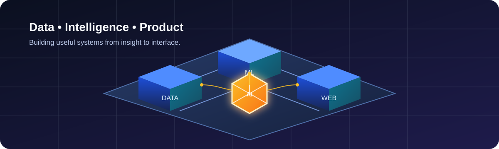

<div align="center">



# Aniket Yadav

### Data Scientist · Machine Learning Engineer · Full-Stack Developer

I build dependable AI products—from data and model experimentation to polished web experiences.

[](https://github.com/Aniketyadav29)

[About](#about) · [Projects](#selected-projects) · [Technology](#technology) · [3D Graph](#3d-contribution-graph)

</div>

---

## About

```yaml
location: India
education: B.Tech, Babu Banarasi Das University
specialties:
  - Applied machine learning and explainable predictions
  - Retrieval-augmented generation and LLM applications
  - Production APIs, data systems, and responsive web products
currently_exploring:
  - Agentic AI systems
  - Hybrid retrieval and evaluation for LLM applications
```

I enjoy translating complex data and AI workflows into clear, useful products. My work combines predictive modelling, RAG systems, automation, and full-stack engineering—with an emphasis on reliable user experiences.

## Selected Projects

| Project | What it does | Technology | Explore |
| --- | --- | --- | --- |
| **Credo-fin** | AI-assisted credit scoring using alternative signals and explainable decision support. | Python, XGBoost, Gemini, MongoDB | Project overview |
| **AAYU** | Conversational wellness utility with severity-evaluation logic and messaging integration. | Flask, Twilio, RAG, SQLite | [Live site](https://aayu-ayurvedic-ai.vercel.app) |
| **Nano Link** | Lightweight URL shortener for clean sharing and dependable redirects. | Web development | [Live site](https://nano-link-dun.vercel.app) |
| **Recipe Book** | Responsive recipe discovery and organisation app with search and collections. | Web development, UI/UX | [Live site](https://recipe-book-psi-sage.vercel.app) |
| **Email Automation System** | Team project for campaign workflows, personalised outreach, and sequences. | Automation, web development | [Live site](https://email-automation-tool-3qzm.vercel.app) |

## Internship Projects

| Project | Description | Links |
| --- | --- | --- |
| **AgentForge** | Multi-agent research and document intelligence platform with RAG, live web research, and streaming reports. | Internship project |
| **Universal RAG System** | Multi-format RAG platform with hybrid retrieval, reranking, and Groq-powered responses. | [Live demo](https://universalragsystemgit-ani.streamlit.app/) |

## Technology

<p align="center">
  
</p>

<details>
<summary><strong>AI, data, and platform tools</strong></summary>

LangChain · OpenAI · Gemini · Groq · Hugging Face · XGBoost · TensorFlow · PyTorch · scikit-learn · Pandas · NumPy · ChromaDB · Supabase · Vercel · Postman

</details>

## GitHub Activity

<p align="center">
  
  
</p>

<p align="center">
  
</p>

## 3D Contribution Graph

The isometric hero at the top is a built-in 3D visual and renders as soon as `hero-banner.svg` is uploaded. To add a live 3D contribution graph, first upload [`.github/workflows/profile-3d.yml`](.github/workflows/profile-3d.yml) to your profile repository, then run **Actions → Generate 3D Contribution Graph → Run workflow** once. After it creates `profile-3d-contrib/profile-night-rainbow.svg`, add this line below:

```html

```

---

<p align="center">
  <strong>Open to collaborating on useful AI, data, and full-stack products.</strong><br />
  <sub>Build thoughtfully. Learn continuously. Ship useful things.</sub>
</p>
