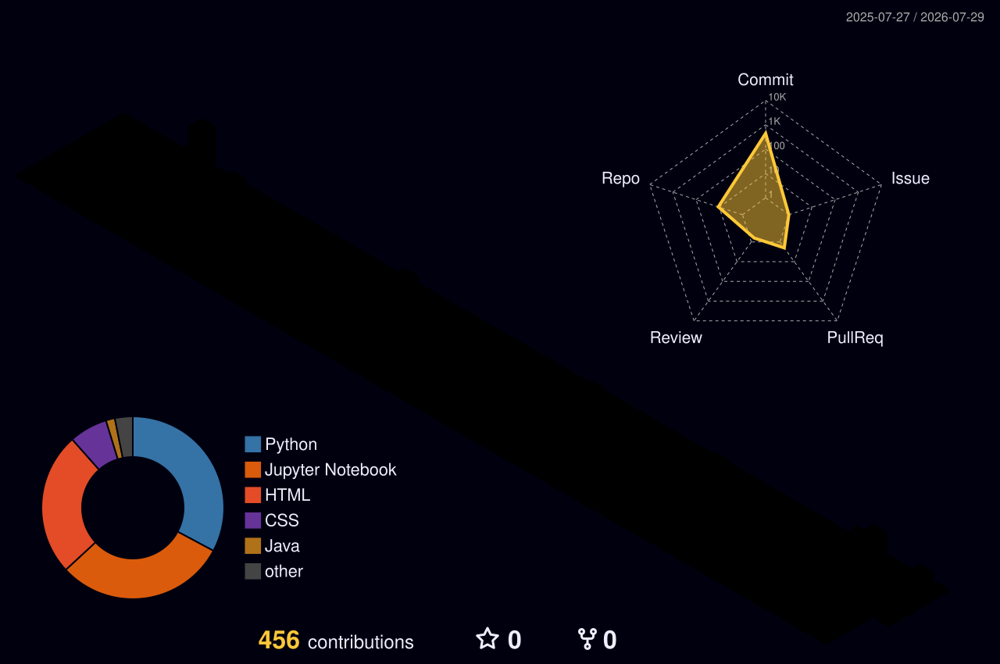

<div align="center">

<!--
  🎨 3D / ISOMETRIC HERO BANNER
  Markdown/HTML in a GitHub README can't run real 3D (no WebGL/Three.js/Lottie scripts),
  so the standard workaround is to embed a pre-rendered isometric illustration or looping GIF.

  Recommended free sources made for exactly this look:
   - unDraw (https://undraw.co) → search "data", "machine learning", "server" → isometric style pack
   - Storyset (https://storyset.com) → filter by "Isometric" → "Data" / "AI" collections
   - LottieFiles (https://lottiefiles.com) → export as GIF (README can't run Lottie JSON directly)

  Steps: download the illustration → commit it into this repo as assets/hero-banner.gif →
  the  below will pick it up automatically.
-->


<a href="https://git.io/typing-svg"></a>

<p>
  <a href="https://www.linkedin.com/in/aniketyadav29/"></a>
  <a href="mailto:anikety7905@gmail.com"></a>
  <a href="https://portpholio-sandy.vercel.app/"></a>
</p>

</div>

---

## 🧠 About Me

```yaml
# aniketyadav :: developer.yml
identity:         Aniket Yadav
username:         "@aniket-yadav"
base:             India 🇮🇳
designation:      Data Scientist · ML Engineer · Fron-end Developer
education:        "B.Tech, Babu Banarasi Das University (BBDU)"

presently:
  developing:       "AI-driven predictive models and intelligent web applications"
  exploring:        ["RAG systems", "LLM architectures", "Hybrid ML", "Python automation"]
  passionate_about: "Bridging complex machine learning with interactive, eye-catching frontend designs"

core_beliefs:
  - "Data is the raw material → ML is the engine that drives real-world impact"
  - "The best AI solves actual problems, from financial inclusion to factual accuracy"
  - "A powerful model deserves a seamless full-stack interface"
  - "Code professionally. Build innovatively. Document flawlessly."

trivia:"I build ML pipelines to predict loan risks and detect fake news... and then I code the interactive portfolios to show them off!"
```

---

## 💻 Tech Stack

**Languages**


**Frameworks & Runtimes**


**AI & ML**


**Data & Cloud**


**APIs, Dev Tools & Integrations**


---

## 🚀 Featured Projects

<!-- Depth effect: GitHub strips inline CSS/box-shadow from README HTML, so the reliable
     native workaround for a "raised card" look is a nested blockquote — its left border
     + background tint reads as a layer floating above the page. -->

<table>
<tr>
<td width="50%" valign="top">

**💳 Credo-fin** *AI-driven credit scoring for underbanked populations*

> An AI-driven credit scoring platform combining gradient-boosted models with an LLM reasoning layer for explainable credit decisions — using an XGBoost risk model trained on alternative credit signals, a Gemini LLM layer for human-readable score explanations, and a MongoDB-backed pipeline for fast applicant lookups.
>
> `Python` `XGBoost` `Gemini LLM` `MongoDB`
>
> 💻 [Code](#) · 🚀 [Live](https://credo-one-1.vercel.app)

</td>
<td width="50%" valign="top">

**🔗 Nano Link** *Compact, secure URL shortener*

> Built for secure redirects, clean link sharing, and fast web access.
>
> `URL Shortener` `Secure Redirects` `Web App`
>
> 💻 [Code](#) · 🚀 [Live](https://nano-link-dun.vercel.app)

</td>
</tr>
<tr>
<td width="50%" valign="top">

**🌿 AAYU** *Conversational Ayurvedic wellness assistant*

> Delivers Ayurvedic wellness logic over Twilio, with condition severity evaluation (mild/moderate/severe).
>
> `Flask` `Twilio API` `RAG Pipeline` `SQLite`
>
> 💻 [Code](#) · 🚀 [Live](https://aayu-ayurvedic-ai.vercel.app)

</td>
<td width="50%" valign="top">

**💼 OpportuAI** *AI job opportunity hunter*

> Scans the web for job listings, matches them to your skills using LLMs, and surfaces the best opportunities.
>
> `Python` `LLMs` `Web Scraping`
>
> 💻 [Code](#) · 🚀 [Live](#)

</td>
</tr>
</table>

---

## ⚡ Personal Projects

<table>
<tr>
<td colspan="2" valign="top">

**📖 Recipe Book** *Fast, clean recipe collection manager*

> A web app for browsing, saving, and organizing recipes in one clean, easy-to-use collection — with instant search and category filters, personal collections to save favourite dishes, and a responsive, mobile-friendly layout for cooking on the go.
>
> `Web App` `Recipes` `UI/UX`
>
> 💻 [Code](#) · 🚀 [Live](https://recipe-book-psi-sage.vercel.app)

</td>
</tr>
<tr>
<td colspan="2" valign="top">

**📧 Email Automation System** *Efficient email campaigns, on autopilot*

> An automation tool for efficient email campaigns, automated sequences, and personalized outreach workflows.
>
> `Email` `Automation` `Campaigns`
>
> 💻 [Code](#) · 🚀 [Live](https://email-automation-tool-3qzm.vercel.app)

</td>
</tr>
</table>

---

## 🎓 Internship Projects

<table>
<tr>
<td colspan="2" valign="top">

**⚡ AgentForge** *Autonomous multi-agent AI system & document RAG platform*

> An enterprise-grade autonomous Multi-Agent AI System where specialized agents (Research Strategist, Web Research Specialist, Data Analyst, Report Writer) collaborate in sequential pipelines to research topics, scrape the live web, and produce executive-ready markdown reports streamed live via SSE — alongside a Document RAG & Math Engine that parses PDF/DOCX/CSV/XLSX/TXT into isolated ChromaDB vector stores and runs deterministic Pandas math instead of letting the LLM guess numbers.
>
> `Python` `FastAPI` `CrewAI` `ChromaDB` `Groq` `Gemini` `SQLite`
>
> 💻 [Code](https://github.com/Aniketyadav29/AgentForge) · Status: `Internship`

</td>
</tr>
<tr>
<td colspan="2" valign="top">

**🧠 Universal RAG System** *Production-grade Retrieval-Augmented Generation platform*

> An end-to-end RAG system built with Python, Streamlit, ChromaDB, and Groq. Ingests multi-format documents (PDF, DOCX, TXT, CSV, XLSX) or scraped web pages, applies parent-child hierarchical chunking, and answers queries via a hybrid search engine — dense vector search combined with sparse BM25 lexical search and cross-encoder re-ranking — before generating sub-second responses through Groq's LPU-accelerated LLMs.
>
> `Python` `Streamlit` `ChromaDB` `Groq` `sentence-transformers` `BM25`
>
> 💻 [Code](https://github.com/Aniketyadav29/Universal_Rag_System) · 🚀 [Live](https://universalragsystemgit-ani.streamlit.app/) · Status: `Internship`

</td>
</tr>
</table>

---

## 📊 GitHub Stats

<div align="center">


</div>

## 📈 Contribution Activity

<div align="center">


</div>

## 🧱 3D Contribution Graph

<!--
  Generated automatically by .github/workflows/profile-3d.yml (github-profile-3d-contrib action).
  This turns your commit calendar into an isometric "city block" style 3D graph.
  Setup: this only works in your special profile repo (github.com/Aniketyadav29/Aniketyadav29).
  1. Add the workflow file to that repo.
  2. Run it once manually: Actions → GitHub-Profile-3D-Contrib → Run workflow.
  3. It commits SVGs to profile-3d-contrib/ in the same repo — the path below then renders live.
-->
<div align="center">



</div>

---

<p align="center">
  <a href="https://visitcount.itsvg.in"></a>
</p>


<!--
**Aniketyadav29/Aniketyadav29** is a ✨ _special_ ✨ repository because its `README.md` (this file) appears on your GitHub profile.

Here are some ideas to get you started:

- 🔭 I’m currently working on ...
- 🌱 I’m currently learning ...
- 👯 I’m looking to collaborate on ...
- 🤔 I’m looking for help with ...
- 💬 Ask me about ...
- 📫 How to reach me: ...
- 😄 Pronouns: ...
- ⚡ Fun fact: ...
-->
